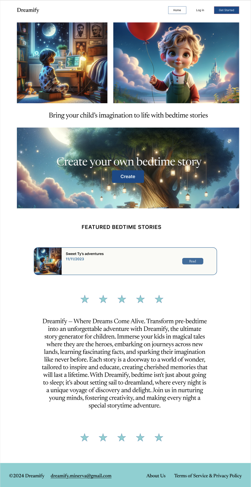
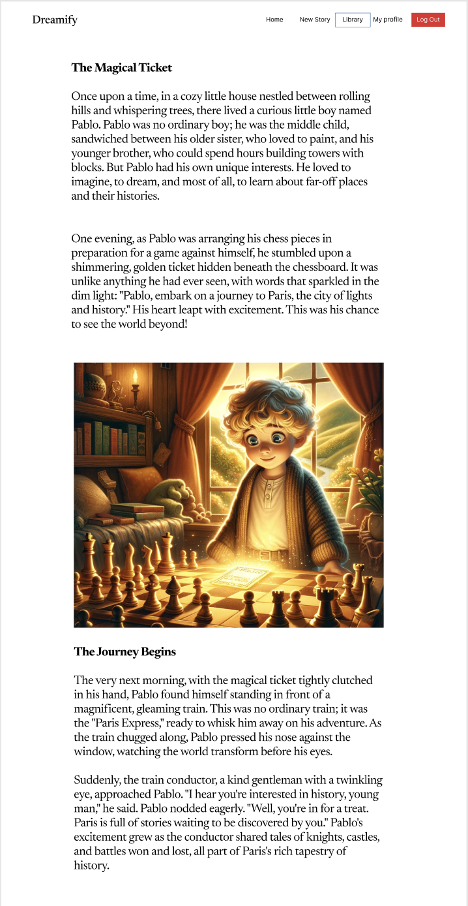

<!-- # Welcome to CS162 Final Project

This project was bootstrapped with [Create React App](https://github.com/facebook/create-react-app).

A Flask based API backend was added in the *api* directory.

Read this [tutorial](https://blog.miguelgrinberg.com/post/how-to-create-a-react--flask-project) on how to create Flask + React combined projects.

## **Please add more to the README**

- Describe the project
- Add screenshots
- Link to figma designs
- Describe team and roles
- Set up unit tests!
- Explain deployment process
- Set up continuous integration pipeline --> 

<a name="readme-top"></a>


<br />
<div align="center">
  <a href="https://github.com/minerva-university">
    
  </a>

<h3 align="center">Dreamify</h3>

  <p align="center">
        Dreamify is a web platform designed to enrich family bedtime routines by creating personalized bedtime stories for children. Recognizing the importance of bedtime stories in developing a child's language skills, empathy, and emotional bonds, Dreamify leverages advanced AI tools to generate unique stories with the child as the protagonist, featuring customizable characters and themes based on the child's interests and physical traits.
    <br />
    <a href="https://drive.google.com/file/d/1HWpfiyR_rrEENRAB89p0RyDiq_fvDl3Q/view?usp=sharing"><strong>Explore the docs »</strong></a>
    <br />
    <br />
    <a href="https://www.figma.com/file/ZaXcdSIkvy0zxM7uetz7wH/Figma-basics?type=design&mode=design&t=VmONGzLsiYv4rWDU-1">View Figma Design</a>
    ·
    <a href="https://github.com/minerva-university/cs162-Dreamify/issues">Report Issues</a>
  </p>
</div>


<!-- TABLE OF CONTENTS -->
<details>
  <summary>Table of Contents</summary>
  <ol>
    <li>
      <a href="#about-the-project">About The Project</a>
      <ul>
        <li><a href="#problem-statement">Problem Statement</a></li>
        <li><a href="#web-interface">Web Interface</a></li>
        <li><a href="#built-with">Built With</a></li>
      </ul>
    </li>
    <li>
      <a href="#getting-started">Getting Started</a>
      <ul>
        <li><a href="#run-backend">Run Backend</a></li>
        <li><a href="#run-frontend">Run Frontend</a></li>
        <li><a href="#run-unittest">Run Unittest</a></li>
        <li><a href="#setup-environment-variable">Setup environment variable </a></li>
      </ul>
    </li>
    <li><a href="#usage">Usage</a></li>
    <li><a href="#team-members">Team Members</a></li>
  </ol>
</details>


<!-- ABOUT THE PROJECT -->
## About The Product

### Problem Statement 

In today's fast-paced world, parents cherish the intimate moments of reading bedtime stories to their children, a practice proven to enhance vocabulary, concentration, and emotional intelligence. However, due to busy schedules, not all parents manage to maintain this precious routine. Dreamify addresses this challenge by offering an innovative solution that not only facilitates this bonding experience but also personalizes it, making every storytime a unique adventure.

### Web Interface
<p align="center">
  <table>
    <tr>
      <td>
        <p align="center"><b>Home Page</b></p>
        <p align="center">
            Bring your child's imagination to life with bedtime stories that are as unique as they are
            <br>
          
        </p>
      </td>
      <td>
        <p align="center"><b>Story Page</b></p>
        <p align="center">
            Immerse your child in a world of adventure with stories that inspire and excite.
            <br>
            
        </p>
      </td>
    </tr>
  </table>
</p>


<p align="right">(<a href="#readme-top">back to top</a>)</p>


### Built With

[![React][React.js]][React-url]  [![Flask][Flask.js]][Flask-url]  [![SQLAlchemy][SQLAlchemy.js]][SQLAlchemy-url] [![GPT][GPT.js]][GPT-url] [![DALL·E][DALL·E.js]][DALL·E-url]


<p align="right">(<a href="#readme-top">back to top</a>)</p>


<!-- GETTING STARTED -->
## Getting Started

To get a local copy up and running follow these simple example steps.

### Run Backend

Install the backend by running:

```bash
    cd api
    python3 -m venv venv
    source venv/bin/activate
    pip3 install -r requirements.txt
```
**Note:** if `pip3` doesn't work, try `pip`

Start the server by running:

```bash
    cd api
    source venv/bin/activate
    flask --app . run
```

**Note**: `flask run` should work, too, because the configuration is saved in `.flaskenv`.

### Run Frontend

In a separate terminal, install the frontend by running:

```bash
    yarn install
    yarn build
```

In a separate terminal, start the server by running:

```bash
    yarn start
```

### Run unittest 

```bash
    cd api
    pytest
```

### Setup environment variable 

```bash
    cd api
    python env_variables_setup.py
```
- Navigate back to the project root folder
- Open the newly created .env file
- Set OPENAI_GENERATE to True
- Fill in your OpenAI API key in OPENAI_API_KEY

<!-- USAGE EXAMPLES -->
## Usage

Dreamify is designed to make bedtime stories a personal and engaging experience for your child. Follow these steps to get started:

1. **Sign Up:**
   - Navigate to `Home`.
   - Click on `Get Started` to create a new account.
   - Fill in the required details to set up your profile.

2. **Add a Child's Profile:**
   - Once logged in, go to the `Profile` section.
   - Click on `Add a kid` to create a profile for your child.
   - Enter the name, age, interests, and other details that will help personalize the stories.

3. **Create a Story:**
   - Click `Create a new story` to start.
   - Select your child's profile to tailor the story to their preferences.
   - Choose a theme or let Dreamify surprise you with a story based on your child's interests.

4. **Read and Share:**
   - After the story is generated, you can read it together with your child on any device.
   - Save your favorite stories to your library for repeat bedtime reading.

<p align="right">(<a href="#readme-top">back to top</a>)</p>


<!-- CONTACT -->
## Team Members

<table align="center">
  <tr>
    <td align="center">
      <a href="src/assets/about_us_page/misha.png">
        <br>
        Mykhailo Chudyk
      </a>
    </td>
    <td align="center">
      <a href="src/assets/about_us_page/paul.png">
        <br>
        Paul Franek
      </a>
    </td>
    <td align="center">
      <a href="src/assets/about_us_page/tamir.png">
        <br>
        Tamirlan Bektemissov
      </a>
    </td>
    <td align="center">
      <a href="src/assets/about_us_page/flambeau.png">
        <br>
        Flambeau Iriho
      </a>
    </td>
    <td align="center">
      <a href="src/assets/about_us_page/billy.png">
        <br>
        Billy Altangerel
      </a>
    </td>
  </tr>
</table>


<p align="right">(<a href="#readme-top">back to top</a>)</p>


<!-- MARKDOWN LINKS & IMAGES -->
<!-- https://www.markdownguide.org/basic-syntax/#reference-style-links -->
[forks-shield]: https://img.shields.io/github/forks/github_username/repo_name.svg?style=for-the-badge
[forks-url]: https://github.com/minerva-university/cs162-Dreamify/forks

[product-screenshot]: src/assets/readme/homepage.png

<!-- Built with-->
[React.js]: https://img.shields.io/badge/React-20232A?style=for-the-badge&logo=react&logoColor=61DAFB
[React-url]: https://reactjs.org/

[Flask.js]: https://img.shields.io/badge/Flask-000000?style=for-the-badge&logo=flask&logoColor=white
[Flask-url]: https://flask.palletsprojects.com/

[SQLAlchemy.js]: https://img.shields.io/badge/SQLAlchemy-ffffff?style=for-the-badge&logo=sqlalchemy&logoColor=black
[SQLAlchemy-url]: https://www.sqlalchemy.org/

[GPT.js]: https://img.shields.io/badge/GPT-008080?style=for-the-badge&logo=openai&logoColor=white
[GPT-url]: https://openai.com/api/

[DALL·E.js]: https://img.shields.io/badge/DALL·E-FFA500?style=for-the-badge&logo=openai&logoColor=white
[DALL·E-url]: https://openai.com/dall-e/