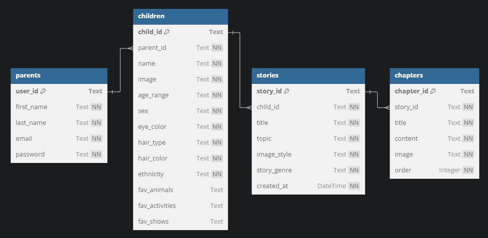

# Backend Overview

## Workflow Explanation

### Basic Database Calls

This applies to all routes that don't call the OpenAI API.

1. Data gets in from the routes (files in `namespaces`)
2. Data gets verified (via `functions/input_validation`)
3. Data gets applied to the database (via functions in `database`)

### Routes calling the OpenAI API

This applies to all routes that use generation (story generation, chapter image generation and child image generation)

1. Data gets in from the routes (files in `namespaces`)
2. Data gets verified (via `functions/input_validation`)
3. A fitting prompt template (from `prompting/prompt_templates.py`) gets chosen
4. The chosen prompt template gets filled in with the given information (`create_story_prompt`/`create_chapter_image_prompt`/`create_chile_image_prompt` in `functions/prompt_assembly.py`)
5. The prepared prompt gets sent to the OpenAI API (`text_gen`/`image_gen`/`image_gen_async` in `functions/openai_functions.py`)
   **Note**: Because the chapter images can be generated independently once the story has been generated, the chapter image generation is processed concurrently
6. The required data (story title, chapter titles and chapter contents) gets extracted with regex (`extract_story_components` in `functions/prompt_assembly.py`)
   **Note**: Of course LLM results can vary but it has worked very well in practice
7. The extracted data gets added to the database (via functions in `database`)

## File Structure Overview

### Folder Root Level Files

- \_\_init\_\_.py: Flask app setup
- api.py: Flask-Restx initialization including the namespace setup in the `namespace` folder
- config.py: contains all Flask app configurations (default (=development), production and testing)
- env_variables_setup.py: script to setup all environment variables with default values for the `.env` file (further explained in the [main project README](https://github.com/minerva-university/cs162-Dreamify/blob/main/README.md))
- extensions.py: contains the used Flask extensions

### database

Contains all database functionalities.

- inserts.py: contains all insertion queries
- models.py: contains all table schemas **as well as indices to speed up queries**
- queries.py: contains all retrieving queries
- updates.py: contains all altering queries
- utilities.py: contains helper functions used for the database functions

**Table Schemas**

### dummy_data

Contains static dummy data used to simulate image and story generation.

### functions

Contains helper and processing functions.

- input_validation.py: functions used to verify inputs for functions
- jwt_functions.py: jwt helper functions (to retrieve the currently logged in parent)
- openai_functions.py: functions to generate text or images by calling the OpenAI API (generate a story, generate a image for a given chapter, given child details, assemble the payloads)
- prepare_data.py: prepares the data for the routes for the frontend
- prompt_assembly.py: functions to fill in the relvant information into the prompt templates and to retrieve all needed story information from the story generation outputs

### namespaces

Contains all routes to communicate with the backend.

Top level route endpoints are auth, children and stories (each separated in a dedicated file)

A detailed route overview can be found in the [namespaces README](https://github.com/minerva-university/cs162-Dreamify/blob/main/api/namespaces/README.md).

### prompting

Contains all static templates to be used for the OpenAI API.

### tests

Contains all tests for the backend.

Run the tests:

1. Make sure you are in the `api` folder in the terminal (run `cd api` if not)
2. Make sure the backend requirements are installed
3. Run `pytest`
